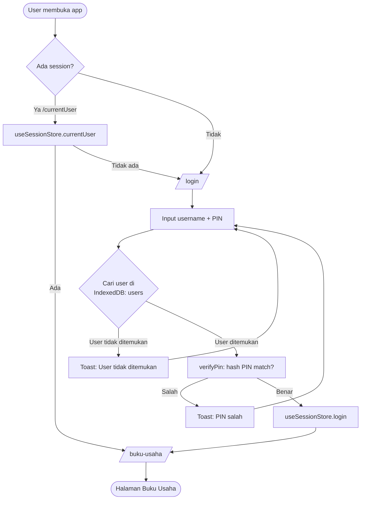
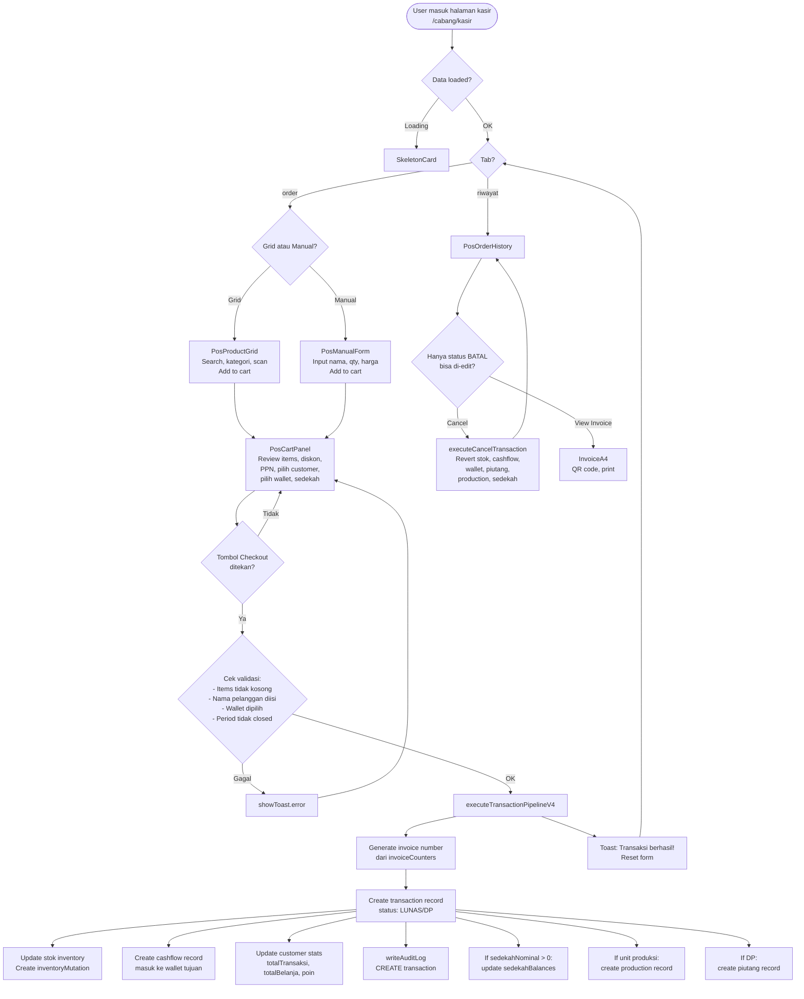
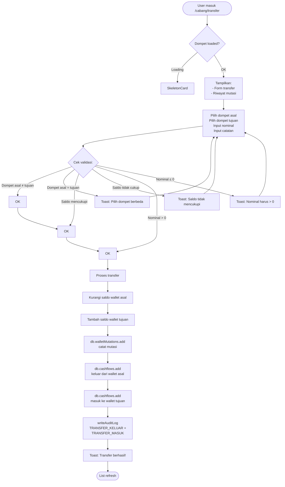

# Business Flow — MMCBANK

> Diagram alur bisnis menggunakan Mermaid flowchart.
> Tools pendukung: https://mermaid.js.org/

---

## 1. Login Flow



**File terkait:** `src/app/(auth)/login/page.tsx`, `src/store/useSessionStore.ts`, `src/lib/crypto.ts`

---

## 2. Kasir (POS Checkout) Flow



**File terkait:** `src/app/(dashboard)/buku-usaha/[cabang]/kasir/page.tsx`, `src/engine/transaction-pipeline-v4.ts`, `src/engine/cancel-transaction.ts`

---

## 3. Inventory Flow

```mermaid
flowchart TD
    Start([User masuk /cabang/inventory]) --> Load{Data loaded?}
    Load -->|Loading| Skeleton[SkeletonCard]
    Load -->|OK| Display[Tampilkan:\n- Summary cards (total value)\n- Search & filter bar\n- Product list]
    
    Display --> Actions{Aksi user}
    
    Actions -->|Tambah| AddForm[Modal: InventoryForm\nNama, SKU, kategori,\nharga modal, harga jual,\nstok, stokMin, satuan,\nbarcode, foto, catatan]
    AddForm --> Save[Tambah ke DB:\ndb.inventory.add]
    Save --> Refresh[List refresh via useLiveQuery]
    
    Actions -->|Edit| EditForm[Modal: InventoryForm\nPre-filled dari data existing]
    EditForm --> Update[db.inventory.update]
    Update --> Refresh
    
    Actions -->|Hapus| Delete[Konfirmasi →\ndb.inventory.delete]
    Delete --> Refresh
    
    Actions -->|Stok Masuk| StockIn[Modal: StockMutation\ntipe=masuk, qty, alasan]
    StockIn --> SaveMut[db.inventory.update stok\n+ db.inventoryMutations.add]
    SaveMut --> Refresh
    
    Actions -->|Stok Keluar| StockOut[Modal: StockMutation\ntipe=keluar, qty, alasan]
    StockOut --> SaveMut
    
    Actions -->|Search| SearchQuery[Filter produk\nby nama]
    SearchQuery --> Display
    
    Actions -->|Filter| FilterMode[All / Low Stock /\nOut of Stock / Mutasi]
    FilterMode --> Display
    
    Actions -->|Barcode Scan| Barcode[BarcodeScanner\nCamera atau manual]
    Barcode --> SearchByBarcode[Cari produk\nby barcode]
    SearchByBarcode --> Display
    
    Actions -->|Kalkulator Harga| Calc[KalkulatorHarga\n6 strategi pricing]
    Calc --> IsiHarga[Set hargaJual dari hasil]
    IsiHarga --> Display
```

**File terkait:** `src/app/(dashboard)/buku-usaha/[cabang]/inventory/page.tsx`, `src/components/business/barcode-scanner.tsx`, `src/components/business/kalkulator-harga.tsx`

---

## 4. Cashflow Flow

```mermaid
flowchart TD
    Start([User masuk /cabang/cashflow\natau /buku-pribadi/cashflow]) --> Load{Data loaded?}
    Load -->|Loading| Skeleton[SkeletonCard]
    Load -->|OK| Display[Tampilkan:\n- Stats: total masuk,\ntotal keluar, selisih\n- Filter: tipe, date range\n- Search bar\n- Daftar cashflow]
    
    Display --> Actions{Aksi user}
    
    Actions -->|Tambah| AddForm[Form: Pilih tipe\n(masuk/keluar),\nkategori, nominal,\nwallet, catatan, tanggal]
    AddForm --> Validate{Cek: nominal > 0?\nWallet dipilih?\nKategori diisi?}
    Validate -->|Gagal| Toast[Toast error]
    Toast --> AddForm
    
    Validate -->|OK| Save[db.cashflows.add\nUpdate wallet saldo\n(+ untuk masuk,\n- untuk keluar)]
    Save --> Refresh[List refresh]
    
    Actions -->|Edit| EditForm[Pre-filled form\nEdit nominal, kategori,\ncatatan]
    EditForm --> Update[db.cashflows.update\n+ Recalculate wallet saldo]
    Update --> Refresh
    
    Actions -->|Hapus| Delete[Konfirmasi →\ndb.cashflows.delete\n+ Reverse wallet saldo]
    Delete --> Refresh
    
    Actions -->|Filter| ApplyFilter[Filter by tipe\ndan date range]
    ApplyFilter --> Display
    
    Actions -->|Search| SearchQuery[Cari by catatan]
    SearchQuery --> Display
    
    Display --> Export{Opsi Laporan}
    Export -->|Lihat Laporan| Laporan[/cabang/laporan/\nPDF, income statement]
```

**File terkait:** `src/app/(dashboard)/buku-usaha/[cabang]/cashflow/page.tsx`, `src/components/business/pribadi-keluarga-cashflow.tsx`

---

## 5. Transfer (Antar Dompet) Flow



**File terkait:** `src/app/(dashboard)/buku-usaha/[cabang]/transfer/page.tsx`

---

## 6. Produksi Flow

```mermaid
flowchart TD
    Start([User masuk /cabang/produksi]) --> Load[Load:\n- Semua production records\n- Filter: status, search]
    
    Load --> Display[Tampilkan:\nSearch bar\nStatus filter\nDaftar production cards]
    
    Display --> Card[Setiap card:\n- Invoice number\n- Nama customer\n- Items\n- Status badge\n- Tombol action]
    
    Card --> Actions{Aksi user}
    
    Actions -->|antre → diproduksi| ToProd[db.productions.update\nstatus: diproduksi]
    ToProd --> Refresh[List refresh]
    
    Actions -->|diproduksi → selesai| ToDone[db.productions.update\nstatus: selesai]
    ToDone --> Refresh
    
    Actions -->|Search| SearchQuery[Filter by invoice/customer]
    SearchQuery --> Display
    
    Actions -->|Filter status| StatusFilter[Tampilkan:\nSemua / Antre /\nDiproduksi / Selesai]
    StatusFilter --> Display

    Note[Status flow:\nantre → diproduksi → selesai\n(hanya maju, tidak bisa mundur)]
```

**File terkait:** `src/app/(dashboard)/buku-usaha/[cabang]/produksi/page.tsx`

> **Catatan:** Production record dibuat otomatis oleh `transaction-pipeline-v4.ts` saat checkout POS untuk unit yang masuk `PRODUCTION_UNITS` (percetakan, konveksi, toko-pakaian).

---

## 7. Piutang Flow

```mermaid
flowchart TD
    Start([Transaksi dengan DP]) --> Pipeline[executeTransactionPipeline]
    
    Pipeline --> Piutang[Sisa tagihan > 0?\nBuat piutang record]
    Piutang --> PiutangDb[Status: AKTIF\nTotal: grandTotal - dpDibayar\nSisa: grandTotal - dpDibayar\nJatuh tempo: +30 hari]
    
    PiutangDb --> View[Halaman yang menampilkan piutang:\n- /cabang/transaksi\n- /cabang/pelanggan\n- /buku-global (tab Piutang)]
    
    View --> Actions{Aksi}
    
    Actions -->|Bayar Cicilan| CicilanForm[Modal:\nJumlah cicilan\nMetode bayar\nCatatan]
    CicilanForm --> Validate{Cek:\njumlah ≤ sisaPiutang?}
    Validate -->|Gagal| Toast[Toast: Melebihi sisa]
    Toast --> CicilanForm
    
    Validate -->|OK| SaveCicil[db.piutangInstallments.add\nUpdate sisaPiutang]
    SaveCicil --> CheckLunas{sisaPiutang = 0?}
    
    CheckLunas -->|Ya| UpdateStatus[db.piutang.update\nstatus: LUNAS]
    CheckLunas -->|Tidak| Refresh[List refresh]
    
    UpdateStatus --> Refresh
    
    Actions -->|Hapus| Delete[Konfirmasi →\ndb.piutang.update\nstatus: DIHAPUS]
    Delete --> Refresh
    
    Actions -->|Notifikasi| Notif[NotificationChecker\nCek piutang jatuh tempo\n3 hari → browser notification]
    
    Refresh --> View
```

**File terkait:** `src/engine/transaction-pipeline-v4.ts`, `src/app/(dashboard)/buku-usaha/[cabang]/transaksi/page.tsx`, `src/app/(dashboard)/buku-usaha/[cabang]/pelanggan/page.tsx`, `src/components/layout/notification-checker.tsx`, `src/components/business/global-piutang-tab.tsx`

---

## 8. Buku Global — Multi-Branch Aggregator

```mermaid
flowchart TD
    Start([User masuk /buku-global]) --> Load[Load semua data\ndari seluruh unit usaha\n(POS_UNITS)]
    
    Load --> Tabs{Tab aktif}
    
    Tabs -->|Dashboard| KPI[GlobalKpiCards]
    KPI --> Metrics[Tampilkan:\n- Total pendapatan semua cabang\n- Laba bersih\n- Cashflow masuk/keluar\n- Piutang aktif count\n- Low stock alerts\n- AreaChart 7-day trend\n- BarChart per-branch revenue]
    
    Tabs -->|Piutang| Piutang[GlobalPiutangTab]
    Piutang --> PiutangList[Search + filter branch\n→ semua piutang AKTIF\ndari semua cabang]
    
    Tabs -->|Pelanggan| Pelanggan[GlobalPelangganTab]
    Pelanggan --> PelangganList[Search + filter branch\n→ semua customers\ndari semua cabang]
    
    Tabs -->|Audit| Audit[GlobalAuditTab]
    Audit --> AuditList[Search + filter\nbranch + action type\n→ semua auditLogs]
    
    Tabs -->|Settings| Settings[GlobalSettingsTab]
    Settings --> Features[Theme toggle\nBackup IndexedDB\nRestore IndexedDB\nReset all data\nTransfer antar cabang\nManajemen inventory global\nAccount management]
    
    Settings -->|Transfer Antar Cabang| Transfer[executeTransfer\ndouble-entry.ts]
    Transfer --> FromBranch[Kurangi saldo wallet\ncabang asal]
    Transfer --> ToBranch[Tambah saldo wallet\ncabang tujuan]
    Transfer --> AuditLog[writeAuditLog\nkedua cabang]
    
    Settings -->|Backup| Backup[createBackup\nExport seluruh IndexedDB\n→ download JSON]
    Settings -->|Restore| Restore[restoreBackup\nUpload JSON\n→ overwrite IndexedDB]
    
    Tabs -->|Dompet| Dompet[GlobalDompetTab]
    Dompet --> WalletList[Lihat semua wallet\nsemua cabang\nCRUD per wallet]
    
    Tabs -->|Profil| Profil[GlobalProfilTab]
    Profil --> Edit[Edit nama, HP, alamat\nLihat wallet user]
```

**File terkait:** `src/app/(dashboard)/buku-global/page.tsx`, `src/engine/double-entry.ts`, `src/lib/backup.ts`, `src/lib/export-utils.ts`, semua `global-*-tab.tsx`

---

## Ringkasan Alur Data

```
┌──────────────┐    ┌──────────────────┐    ┌──────────────────┐
│  User Action  │───▶│  Page Handler    │───▶│  Dexie.js (IDB)  │
│  (click, tap) │    │  (event handler) │    │  (CRUD)          │
└──────────────┘    └──────────────────┘    └────────┬─────────┘
                                                     │
                                                     ▼
                                            ┌──────────────────┐
                                            │  React Re-render │
                                            │  (useLiveQuery)  │
                                            └──────────────────┘
                                                     │
                                                     ▼
                                            ┌──────────────────┐
                                            │  UI Update       │
                                            │  (component)     │
                                            └──────────────────┘
```

Untuk transaksi kompleks (POS checkout, cancel, transfer), ada lapisan `engine/` yang memastikan atomicity:

```
Page Handler ──▶ Engine Function ──▶ Multiple Dexie operations
                                      (transaction, cashflow,
                                       inventory, customer,
                                       piutang, sedekah,
                                       production, audit)
```
