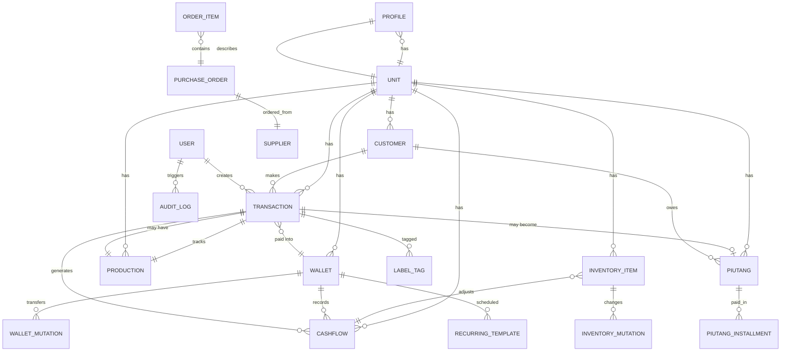

# DATABASE ARCHITECTURE — MMCBANK v7

> **Versi Dokumen:** 1.0  
> **Database:** `mmcbank-v6` (Dexie.js IndexedDB)  
> **Schema Version:** 7  
> **Total Table:** 24 aktif (+1 legacy/recurringTemplates tidak di schema terbaru)  
> **Teknologi:** Dexie.js 4.x + IndexedDB (client-side)

---

## 1. DOMAIN MODEL

Seluruh entity dikelompokkan ke dalam 7 domain. Setiap domain memiliki tanggung jawab yang jelas dan terisolasi.

```
┌─────────────────────────────────────────────────────────┐
│                     DOMAIN MAP                          │
│                                                         │
│  CORE      │  BUSINESS   │  FINANCE    │  INVENTORY     │
│  ─────     │  ────────   │  ───────    │  ─────────     │
│  User      │  QuickOrder │  Wallet     │  InventoryItem │
│  Profile   │  Label      │  WalletMut  │  InventoryMut  │
│  Invoice   │  LabelTag   │  Cashflow   │                │
│  Counter   │  Supplier   │  Budget     │  PRODUCTION    │
│            │  PO         │  Sedekah    │  ──────────    │
│  CRM       │             │  ExchangeRt │  Production    │
│  ─────     │             │  Period     │                │
│  Customer  │             │  Recurring  │  SYSTEM        │
│  Transact. │             │             │  ────────      │
│  Piutang   │             │             │  AuditLog      │
│  PiutInst  │             │             │                │
└─────────────────────────────────────────────────────────┘
```

### 1.1 CORE DOMAIN

| Aspek | Deskripsi |
|-------|-----------|
| **Tujuan** | Mengelola identitas pengguna, profil bisnis, dan counter dokumen |
| **Entity** | `DbUser`, `DbProfile`, `DbInvoiceCounter` |
| **Hubungan** | Semua domain lain membutuhkan `DbUser` untuk audit trail. `DbInvoiceCounter` digunakan oleh transaksi di CRM. |

### 1.2 BUSINESS DOMAIN

| Aspek | Deskripsi |
|-------|-----------|
| **Tujuan** | Menyimpan data operasional non-finansial: pesanan cepat, label, supplier, dan purchase order |
| **Entity** | `DbQuickOrder`, `DbLabel`, `DbLabelTag`, `DbSupplier`, `DbPurchaseOrder`, `DbPurchaseOrderItem` |
| **Hubungan** | `DbPurchaseOrder` → `DbSupplier`; `DbLabelTag` → `DbTransaction`; `DbQuickOrder` → digunakan di POS (Kasir) |

### 1.3 FINANCE DOMAIN

| Aspek | Deskripsi |
|-------|-----------|
| **Tujuan** | Mengelola seluruh siklus keuangan: dompet, mutasi, cashflow, anggaran, sedekah, kurs, periode akuntansi, dan transaksi berulang |
| **Entity** | `DbWallet`, `DbWalletMutation`, `DbCashflow`, `DbBudget`, `DbSedekahBalance`, `DbExchangeRate`, `DbPeriod`, `DbRecurringTemplate` |
| **Hubungan** | `DbCashflow` adalah pusat — direferensi oleh transaksi, mutasi, sedekah, recurring, dan retur. `DbPeriod` menjadi parent logis untuk laporan. |

### 1.4 INVENTORY DOMAIN

| Aspek | Deskripsi |
|-------|-----------|
| **Tujuan** | Mengelola stok barang dan mutasi persediaan |
| **Entity** | `DbInventoryItem`, `DbInventoryMutation` |
| **Hubungan** | `DbInventoryItem` digunakan oleh transaksi di CRM. Mutasi inventaris dipicu oleh transaksi penjualan, pembelian, atau penyesuaian manual. |

### 1.5 PRODUCTION DOMAIN

| Aspek | Deskripsi |
|-------|-----------|
| **Tujuan** | Melacak status produksi pesanan (antre → diproduksi → selesai) |
| **Entity** | `DbProduction` |
| **Hubungan** | Setiap `DbProduction` terikat ke satu `DbTransaction` melalui `transactionId`. Status produksi bersifat independen dari status pembayaran. |

### 1.6 CRM DOMAIN

| Aspek | Deskripsi |
|-------|-----------|
| **Tujuan** | Mengelola data pelanggan, transaksi penjualan, dan piutang |
| **Entity** | `DbCustomer`, `DbTransaction`, `DbTransactionItem`, `DbPiutang`, `DbPiutangInstallment` |
| **Hubungan** | `DbCustomer` → `DbTransaction` → `DbPiutang` → `DbPiutangInstallment` |

### 1.7 SYSTEM DOMAIN

| Aspek | Deskripsi |
|-------|-----------|
| **Tujuan** | Audit trail untuk semua perubahan data penting |
| **Entity** | `DbAuditLog` |
| **Hubungan** | Mencatat CREATE/UPDATE/DELETE dari entity di domain lain |

---

## 2. ENTITY RELATION

### 2.1 DbUser

| Atribut | Nilai |
|---------|-------|
| **Fungsi** | Menyimpan data login pengguna |
| **Parent** | — |
| **Child** | `DbAuditLog.userId`, `DbTransaction.userId` |
| **Digunakan oleh** | Login, Register, Forgot Pin, Profile, Buku Global |

### 2.2 DbProfile

| Atribut | Nilai |
|---------|-------|
| **Fungsi** | Menyimpan profil usaha per unit |
| **Parent** | — |
| **Child** | — |
| **Digunakan oleh** | Buku Global → tab Profil (settings) |

### 2.3 DbInvoiceCounter

| Atribut | Nilai |
|---------|-------|
| **Fungsi** | Counter nomor invoice per prefix (PRT, LPT, GDG, dll) |
| **Parent** | — |
| **Child** | — |
| **Digunakan oleh** | Transaction Pipeline |

### 2.4 DbQuickOrder

| Atribut | Nilai |
|---------|-------|
| **Fungsi** | Template pesanan cepat untuk POS |
| **Parent** | — |
| **Child** | — |
| **Digunakan oleh** | Kasir (POS) |

### 2.5 DbLabel & DbLabelTag

| Atribut | Nilai |
|---------|-------|
| **Fungsi** | Sistem label untuk mengkategorikan transaksi |
| **Parent** | — |
| **Child** | `DbLabelTag` → `DbLabel` |
| **Digunakan oleh** | Transaksi, Laporan |

### 2.6 DbSupplier

| Atribut | Nilai |
|---------|-------|
| **Fungsi** | Data pemasok barang |
| **Parent** | — |
| **Child** | `DbPurchaseOrder.supplierId` |
| **Digunakan oleh** | Inventory, Purchase Order |

### 2.7 DbPurchaseOrder & DbPurchaseOrderItem

| Atribut | Nilai |
|---------|-------|
| **Fungsi** | Pesanan pembelian barang ke supplier |
| **Parent** | `DbSupplier` |
| **Child** | — |
| **Digunakan oleh** | Inventory |

### 2.8 DbWallet

| Atribut | Nilai |
|---------|-------|
| **Fungsi** | Dompet/akun kas per unit bisnis |
| **Parent** | — |
| **Child** | `DbCashflow.walletId`, `DbWalletMutation` |
| **Digunakan oleh** | Kasir, Cashflow, Laporan, Dompet |

### 2.9 DbWalletMutation

| Atribut | Nilai |
|---------|-------|
| **Fungsi** | Mencatat transfer antar dompet |
| **Parent** | `DbWallet` (dariWalletId, keWalletId) |
| **Child** | — |
| **Digunakan oleh** | Dompet → Transfer |

### 2.10 DbCashflow

| Atribut | Nilai |
|---------|-------|
| **Fungsi** | Catatan arus kas — sumber kebenaran laporan keuangan |
| **Parent** | `DbWallet` |
| **Child** | — |
| **Digunakan oleh** | Laporan, Dashboard, Cashflow page |

### 2.11 DbBudget

| Atribut | Nilai |
|---------|-------|
| **Fungsi** | Anggaran per kategori per periode |
| **Parent** | — |
| **Child** | — |
| **Digunakan oleh** | Laporan → Budget |

### 2.12 DbSedekahBalance

| Atribut | Nilai |
|---------|-------|
| **Fungsi** | Saldo sedekah per unit (zakat, infak, sedekah) |
| **Parent** | — |
| **Child** | — |
| **Digunakan oleh** | Kasir, Laporan |

### 2.13 DbExchangeRate

| Atribut | Nilai |
|---------|-------|
| **Fungsi** | Kurs mata uang asing |
| **Parent** | — |
| **Child** | — |
| **Digunakan oleh** | (Future) Multi-currency |

### 2.14 DbPeriod

| Atribut | Nilai |
|---------|-------|
| **Fungsi** | Periode akuntansi (bulanan) — open/closed |
| **Parent** | — |
| **Child** | — |
| **Digunakan oleh** | Laporan, Tutup Buku |

### 2.15 DbRecurringTemplate

| Atribut | Nilai |
|---------|-------|
| **Fungsi** | Template transaksi berulang (bulanan/mingguan) |
| **Parent** | `DbWallet` |
| **Child** | — |
| **Digunakan oleh** | Cashflow → Recurring |

### 2.16 DbInventoryItem

| Atribut | Nilai |
|---------|-------|
| **Fungsi** | Data master barang — stok, harga, kategori |
| **Parent** | — |
| **Child** | `DbInventoryMutation.itemId` |
| **Digunakan oleh** | Kasir, Inventory, Laporan |

### 2.17 DbInventoryMutation

| Atribut | Nilai |
|---------|-------|
| **Fungsi** | Mencatat perubahan stok (masuk/keluar/penyesuaian) |
| **Parent** | `DbInventoryItem` |
| **Child** | — |
| **Digunakan oleh** | Inventory |

### 2.18 DbProduction

| Atribut | Nilai |
|---------|-------|
| **Fungsi** | Tracking status produksi pesanan |
| **Parent** | `DbTransaction` |
| **Child** | — |
| **Digunakan oleh** | Kanban Produksi |

### 2.19 DbCustomer

| Atribut | Nilai |
|---------|-------|
| **Fungsi** | Data pelanggan |
| **Parent** | — |
| **Child** | `DbTransaction.customerId`, `DbPiutang.customerId` |
| **Digunakan oleh** | CRM Pelanggan, Kasir, Piutang |

### 2.20 DbTransaction & DbTransactionItem

| Atribut | Nilai |
|---------|-------|
| **Fungsi** | Transaksi penjualan — sumber dari semua turunan data |
| **Parent** | `DbCustomer`, `DbUser`, `DbWallet` |
| **Child** | `DbPiutang.transactionId`, `DbProduction.transactionId`, `DbCashflow.referensiId`, `DbLabelTag.transaksiRef` |
| **Digunakan oleh** | Kasir, Transaksi, Laporan, Dashboard, Piutang |

### 2.21 DbPiutang

| Atribut | Nilai |
|---------|-------|
| **Fungsi** | Mencatat piutang dari transaksi yang belum lunas |
| **Parent** | `DbTransaction`, `DbCustomer` |
| **Child** | `DbPiutangInstallment.piutangId` |
| **Digunakan oleh** | Piutang, Dashboard |

### 2.22 DbPiutangInstallment

| Atribut | Nilai |
|---------|-------|
| **Fungsi** | Cicilan pembayaran piutang |
| **Parent** | `DbPiutang` |
| **Child** | — |
| **Digunakan oleh** | Piutang → Detail |

### 2.23 DbAuditLog

| Atribut | Nilai |
|---------|-------|
| **Fungsi** | Audit trail — mencatat setiap perubahan data penting |
| **Parent** | `DbUser` |
| **Child** | — |
| **Digunakan oleh** | Buku Global → Audit Log |

---

## 3. RELATIONSHIP (ERD)



### Relasi Utama (Business → Finance Flow)

```
BUSINESS (UnitId)
    │
    ├── PROFILE → deskripsi usaha
    │
    ├── WALLET → dompet operasional
    │     ├── WALLET_MUTATION → transfer antar dompet
    │     └── CASHFLOW → arus kas
    │
    ├── TRANSACTION → penjualan
    │     ├── CASHFLOW → masuk ke wallet
    │     ├── PIUTANG → jika belum lunas
    │     │     └── PIUTANG_INSTALLMENT → cicilan
    │     ├── PRODUCTION → jika perlu produksi
    │     └── LABEL_TAG → label transaksi
    │
    ├── INVENTORY_ITEM → stok barang
    │     └── INVENTORY_MUTATION → perubahan stok
    │
    ├── CUSTOMER → data pelanggan
    │
    ├── SUPPLIER → pemasok
    │     └── PURCHASE_ORDER → pesanan pembelian
    │
    ├── BUDGET → anggaran bulanan
    ├── PERIOD → periode akuntansi
    ├── RECURRING_TEMPLATE → transaksi otomatis
    └── SEDEKAH_BALANCE → saldo sedekah
```

---

## 4. DATABASE RESPONSIBILITY

### 4.1 Tabel dan Tanggung Jawab

| Table | Boleh Menyimpan | Tidak Boleh Menyimpan |
|-------|-----------------|------------------------|
| **users** | Data login, PIN hash, role, foto profil, unit akses | Riwayat login, session token, password plaintext |
| **profiles** | Nama usaha, logo, alamat, kontak, slogan | Data transaksi, data stok, data pelanggan |
| **wallets** | Nama dompet, saldo, tipe, rekening | Histori transaksi, data pengguna, stok barang |
| **walletMutations** | Transfer nominal, wallet asal/tujuan | Data transaksi penjualan, data inventory |
| **customers** | Nama, nomor WA, poin, total belanja | Invoice, histori transaksi detail, PIN |
| **transactions** | Item, diskon, PPN, status, grandTotal | Status produksi (pisah ke productions), cicilan (pisah ke piutangInstallments) |
| **piutang** | Sisa piutang, jatuh tempo, status, hubungan transaksi | Detail item transaksi, cashflow entry |
| **piutangInstallments** | Jumlah cicilan, metode, tanggal | Data pelanggan, data transaksi |
| **inventory** | SKU, stok, harga modal/jual, kategori, barcode | Histori penjualan, data supplier |
| **inventoryMutations** | Qty, stok sebelum/sesudah, alasan | Harga jual, data pelanggan |
| **labels** | Nama label, warna | Data transaksi |
| **labelTags** | Relasi label ↔ transaksi | Konten label, konten transaksi |
| **quickOrders** | Template item cepat (desc + price) | Histori pesanan |
| **auditLogs** | Action, entity type, data before/after, user | Data sensitif seperti PIN |
| **cashflows** | Tipe masuk/keluar, nominal, wallet, referensi | Data pelanggan, data item transaksi |
| **productions** | Status produksi, relasi transaksi | Detail transaksi, data pembayaran |
| **sedekahBalances** | Saldo zakat/infak/sedekah | Data transaksi, data donatur |
| **invoiceCounters** | Prefix + counter berjalan | Data transaksi |
| **suppliers** | Nama, kontak, alamat | Data stok, data pembelian |
| **purchaseOrders** | PO number, supplier, items, status | Data transaksi penjualan |
| **budgets** | Kategori, jumlah, periode | Data realisasi, data transaksi |
| **periods** | Periode, status open/closed, laba bersih | Data transaksi detail |
| **recurringTemplates** | Nama template, jumlah, frekuensi, wallet | Data transaksi yang sudah digenerate |
| **exchangeRates** | From/to currency, rate | Data transaksi |

### 4.2 Prinsip Umum

1. **Satu sumber kebenaran**: Tidak ada duplikasi data antar tabel. Jika data diperlukan di banyak tempat, gunakan referensi ID.
2. **Deduksi, bukan penyimpanan**: Laporan tidak disimpan — selalu dihitung dari data transaksi + cashflow.
3. **Audit eksternal**: Data audit disimpan terpisah dari data bisnis agar tidak terkontaminasi.
4. **Denormalisasi terbatas**: Field seperti `customerNama` di `transactions` dan `piutang` adalah snapshot — boleh berbeda dari data customer saat ini.
5. **Unit isolation**: Semua data dibatasi oleh `unitId` — tidak ada query lintas unit kecuali di dashboard global.

---

## 5. DATA FLOW

### 5.1 Kasir → Transaksi → Wallet → Cashflow → Laporan

```
KASIR (POS)
   │
   ├── Pilih Pelanggan (DbCustomer)
   ├── Tambah Item (dari DbInventoryItem atau manual)
   ├── Atur Diskon (+ diskon item & global)
   ├── Atur PPN (11%)
   ├── Pilih Dompet Tujuan (DbWallet)
   ├── Tentukan Status: LUNAS / DP
   │
   ▼
TRANSACTION PIPELINE (engine/transaction-pipeline-v4.ts)
   │
   ├── 1. Buat DbTransaction + items
   ├── 2. Kurangi stok (DbInventoryItem.stok -= qty)
   ├── 3. Catat inventaris mutasi (DbInventoryMutation)
   ├── 4. Update Wallet (DbWallet.saldo += grandTotal)
   ├── 5. Catat Cashflow (DbCashflow: tipe="masuk")
   ├── 6. Jika DP → Buat DbPiutang
   │        └── Jika LUNAS & sisaTagihan=0 → DbPiutang.status="LUNAS"
   ├── 7. Update invoice counter (DbInvoiceCounter.counter++)
   └── 8. Catat Audit Log (DbAuditLog)
   │
   ▼
LAPORAN (dihitung real-time dari data)
   ├── Total Penjualan = SUM(DbTransaction.grandTotal)
   ├── Laba Kotor = SUM(grandTotal) - SUM(items.qty * items.hargaModal)
   ├── Cashflow = DbCashflow (filter tipe & periode)
   └── Piutang = DbPiutang (filter status="AKTIF")
```

### 5.2 Inventory Flow

```
SUPPLIER → PURCHASE ORDER → INVENTORY (Stok Masuk)
                                       │
                                       ▼
                            INVENTORY ITEM (stok + qty)
                                       │
                              ┌────────┴────────┐
                              ▼                  ▼
                       PENJUALAN            PENYESUAIAN
                       (via Kasir)          (manual)
                              │                  │
                              ▼                  ▼
                      INVENTORY MUTATION   INVENTORY MUTATION
                      (tipe="keluar")      (tipe="penyesuaian")
```

### 5.3 Transfer Antar Dompet

```
WALLET A (saldo - nominal)
      │
      │  WALLET_MUTATION (dariWalletId → keWalletId)
      ▼
WALLET B (saldo + nominal)
      │
      ├── CASHFLOW A (tipe="keluar", referensiTipe="mutasi")
      └── CASHFLOW B (tipe="masuk", referensiTipe="mutasi")
```

### 5.4 Produksi Flow

```
TRANSACTION (status=DP/LUNAS)
      │
      ▼
PRODUCTION (status="antre")
      │
      ▼
PRODUCTION (status="diproduksi")  ← Manual di Kanban
      │
      ▼
PRODUCTION (status="selesai")     ← Manual di Kanban
```

### 5.5 Piutang Flow

```
TRANSACTION (sisaTagihan > 0)
      │
      ▼
PIUTANG (status="AKTIF", sisaPiutang = totalPiutang)
      │
      ├── Pembayaran 1 → PIUTANG_INSTALLMENT (jumlah)
      │                    └── sisaPiutang -= jumlah
      ├── Pembayaran 2 → PIUTANG_INSTALLMENT (jumlah)
      │                    └── sisaPiutang -= jumlah
      └── Jika sisaPiutang = 0 → PIUTANG.status = "LUNAS"
```

### 5.6 Retur Flow

```
TRANSACTION (status="BATAL")
      │
      ├── Inventory kembali (+qty)
      │     └── INVENTORY_MUTATION (tipe="masuk")
      ├── Cashflow pembatalan
      │     └── CASHFLOW (tipe="keluar", referensiTipe="retur")
      └── AUDIT_LOG (action="RETUR")
```

---

## 6. DOMAIN RULES

### 6.1 Core Rules

| # | Aturan |
|---|--------|
| R01 | `DbUser.pinHash` hanya menyimpan hash. PIN plaintext tidak boleh disimpan di tabel manapun. |
| R02 | `DbProfile` hanya menyimpan data profil usaha — bukan data pengguna. |
| R03 | `DbInvoiceCounter` tidak boleh di-reset manual. Hanya increment oleh pipeline. |

### 6.2 Finance Rules

| # | Aturan |
|---|--------|
| R04 | **Transaction tidak boleh langsung mengubah laporan.** Laporan selalu dihitung dari data mentah (transaksi + cashflow). |
| R05 | Setiap perubahan saldo `DbWallet` HARUS disertai `DbCashflow`. Tidak boleh ada perubahan saldo tanpa jejak cashflow. |
| R06 | `DbCashflow.tipe="masuk"` hanya terjadi dari transaksi penjualan, transfer masuk, atau penyesuaian. |
| R07 | `DbCashflow.tipe="keluar"` hanya terjadi dari retur, transfer keluar, pengeluaran manual, atau penyesuaian. |
| R08 | Satu transaksi hanya boleh menghasilkan SATU cashflow entry (ke wallet tujuan). |
| R09 | Transfer antar dompet menghasilkan DUA cashflow entry (keluar dari A, masuk ke B). |
| R10 | `DbBudget` tidak boleh berisi data realisasi — realisasi selalu dihitung dari `DbCashflow`. |
| R11 | `DbPeriod` dengan status `"closed"` TIDAK BOLEH diubah transaksinya. |
| R12 | `DbSedekahBalance` hanya boleh dimodifikasi oleh fitur sedekah di Kasir. |

### 6.3 Inventory Rules

| # | Aturan |
|---|--------|
| R13 | **Wallet tidak boleh memiliki stok.** Stok hanya milik `DbInventoryItem`. |
| R14 | **Produk tidak boleh menyimpan histori transaksi.** Histori transaksi ada di `DbTransaction`. |
| R15 | Setiap perubahan `DbInventoryItem.stok` HARUS disertai `DbInventoryMutation`. |
| R16 | Stok tidak boleh negatif. Pipeline harus validasi sebelum mengurangi stok. |
| R17 | Harga modal (`hargaModal`) hanya boleh diubah melalui mutasi inventaris atau edit manual — bukan dari transaksi penjualan. |

### 6.4 CRM Rules

| # | Aturan |
|---|--------|
| R18 | **Customer tidak boleh menyimpan invoice.** Invoice (nomor, item) disimpan di `DbTransaction`. |
| R19 | `DbCustomer.totalTransaksi` dan `DbCustomer.totalBelanja` adalah field denormalized — boleh di-rekonstruksi dari `DbTransaction` jika diperlukan. |
| R20 | `DbTransaction.customerNama` dan `DbTransaction.customerWA` adalah snapshot — tidak harus sama dengan `DbCustomer.nama` dan `DbCustomer.noWA` saat ini. |

### 6.5 Piutang Rules

| # | Aturan |
|---|--------|
| R21 | `DbPiutang.sisaPiutang` TIDAK BOLEH melebihi `DbPiutang.totalPiutang`. |
| R22 | Setiap pembayaran cicilan HARUS dicatat sebagai `DbPiutangInstallment`. |
| R23 | `DbPiutang` dengan status `"DIHAPUS"` tidak boleh memiliki cicilan baru. |
| R24 | `DbTransaction.sisaTagihan` harus sinkron dengan `DbPiutang.sisaPiutang` (jika ada). |

### 6.6 Production Rules

| # | Aturan |
|---|--------|
| R25 | Status produksi bersifat independen dari status pembayaran. Transaksi `DP` bisa memiliki produksi `selesai`. |
| R26 | Hanya unit yang terdaftar di `PRODUCTION_UNITS` yang boleh memiliki data produksi. |

### 6.7 System Rules

| # | Aturan |
|---|--------|
| R27 | `DbAuditLog` bersifat **append-only**. Tidak boleh diedit atau dihapus. |
| R28 | Setiap perubahan status transaksi (LUNAS, DP, BATAL) WAJIB dicatat di audit log. |
| R29 | `DbAuditLog.dataBefore` dan `DbAuditLog.dataAfter` menyimpan JSON snapshot — bukan referensi. |

### 6.8 Isolation Rules

| # | Aturan |
|---|--------|
| R30 | Semua query HARUS difilter oleh `unitId`. Tidak boleh ada query yang mengakses data semua unit tanpa filter. |
| R31 | Data unit `pribadi` dan `keluarga` TIDAK BOLEH memiliki transaksi dengan inventory atau produksi (hanya cashflow). |
| R32 | `bookOrBranchId` adalah legacy field — untuk semua tabel baru, gunakan `unitId` sebagai primary filter. |

---

## 7. FUTURE EXTENSION

### 7.1 Multi Company

```
COMPANY
   │
   ├── User (userId sekarang → companyId)
   ├── Branch (UnitId → companyId + unitId)
   ├── Wallet
   ├── Transaction
   └── ...
```

**Perubahan yang diperlukan:**
- Tambah tabel `DbCompany { id, nama, logoUrl, ... }`
- Ubah `UnitId` menjadi `companyId + unitId` compound
- Semua tabel perlu field `companyId`
- Dashboard global menjadi lintas-company

**Skor kesiapan saat ini:** 3/10 — karena tidak ada konsep company, semua unit flat.

### 7.2 Multi Currency

**Sudah didukung sebagian:**
- `DbWallet.mataUang?: MataUang`
- `DbTransaction.mataUang?: MataUang`
- `DbCashflow.mataUang?: MataUang`
- `DbExchangeRate` sudah ada

**Yang masih kurang:**
- Konversi otomatis saat transaksi
- Laporan dalam base currency
- Fluktuasi kurs harian

**Skor kesiapan saat ini:** 6/10

### 7.3 Online Sync

**Tantangan:**
- IndexedDB adalah client-side — tidak bisa di-sync langsung
- Perlu middleware seperti PouchDB + CouchDB atau Dexie Cloud

**Strategi:**
1. Setiap tabel memiliki `updatedAt` (ada di inventory, belum di semua tabel)
2. Tambah `syncStatus: "created" | "updated" | "deleted" | "synced"` ke setiap tabel
3. Gunakan Dexie Cloud atau custom REST API dengan conflict resolution

**Skor kesiapan saat ini:** 2/10

### 7.4 Mobile App

**Sudah siap:**
- PWA sudah jalan
- `safe-area-inset` untuk iPhone notch
- Touch-friendly UI
- Offline-first (IndexedDB)

**Yang masih kurang:**
- Service worker untuk background sync
- Push notification
- Biometric authentication (Face ID / Fingerprint)

**Skor kesiapan saat ini:** 7/10

### 7.5 REST API

**Perubahan yang diperlukan:**
- Backend server (Node.js/Go/Rails)
- Mapping IndexedDB → PostgreSQL/MySQL
- Authentication dengan JWT
- Rate limiting, pagination, filtering

**Catatan:**
- Struktur tabel sudah cukup relasional dan bisa langsung di-mapping ke SQL
- Composite key seperti `[bookOrBranchId+noWA]` perlu dipecah jadi unique constraint

**Skor kesiapan saat ini:** 5/10 (data model siap, infrastruktur belum)

### 7.6 Cloud Backup

**Sudah didukung:**
- `lib/backup.ts` — AES-256-GCM encrypted backup/restore
- Export JSON ke file

**Yang perlu ditingkatkan:**
- Auto-backup ke cloud storage (Google Drive, Dropbox, iCloud)
- Scheduled backup
- Incremental backup (saat ini full backup)

**Skor kesiapan saat ini:** 8/10

### 7.7 AI Analytics

**Potensi:**
- Prediksi tren penjualan per kategori
- Anomali deteksi pengeluaran
- Rekomendasi restok inventory
- Segmentasi pelanggan
- Deteksi piutang bermasalah

**Data yang dibutuhkan:**
- `DbTransaction` (histori penjualan)
- `DbInventoryItem` (stok & pergerakan)
- `DbCustomer` (perilaku pelanggan)
- `DbCashflow` (arus kas)

**Kesiapan data:** Data historis sudah lengkap dan terstruktur. AI bisa langsung mengonsumsi data dari IndexedDB melalui export JSON.

**Skor kesiapan saat ini:** 9/10 (data siap, tinggal integration layer)

---

## 8. KESIMPULAN

### 8.1 Apakah struktur database saat ini sudah cukup baik?

| Aspek | Penilaian |
|-------|-----------|
| **Normalisasi** | ✅ Baik — data tidak redundan, referensi menggunakan ID |
| **Isolasi** | ✅ Sangat baik — setiap unit bisnis terisolasi dengan `unitId` |
| **Audit trail** | ✅ Baik — semua perubahan penting tercatat |
| **Schema evolution** | ✅ Dexie versioning memungkinkan migrasi bertahap |
| **Domain separation** | ✅ Cukup — entity sudah dikelompokkan secara logis |
| **Multi-currency** | ✅ Sebagian — field sudah ada, belum fully integrated |
| **Relasi** | ✅ Sesuai kebutuhan — tidak over-engineered |
| **Performance** | ⚠️ Perlu indexed query untuk dataset besar |

### 8.2 Kelemahan

| # | Kelemahan | Dampak |
|---|-----------|--------|
| K01 | `bookOrBranchId` dan `unitId` redundan. History field yang belum dibersihkan. | Kebingungan developer baru, query jadi ambigu |
| K02 | Tidak ada soft delete. Data yang dihapus hilang permanen. | Risiko kehilangan data |
| K03 | Tidak ada `updatedAt` di semua tabel (hanya inventory, production). | Sync dan audit jadi sulit |
| K04 | `DbAuditLog.dataBefore` dan `dataAfter` menyimpan JSON string — query isi data historis tidak bisa di-index. | Analisis historis lambat |
| K05 | Tidak ada constraint referential integrity (Dexie tidak mendukung FK). | Data orphan bisa terjadi |
| K06 | Tidak ada locking mechanism. Race condition mungkin terjadi saat transaksi bersamaan. | Saldo wallet bisa tidak konsisten |
| K07 | `DbTransaction` terlalu besar — menyimpan items sebagai array embedded. Filter individual item tidak bisa di-index. | Query item tertentu lambat |
| K08 | Status transaksi (`LUNAS`, `DP`, `BATAL`) dan status piutang (`AKTIF`, `LUNAS`, `DIHAPUS`) bisa tidak sinkron. | Inconsistency jika pipeline gagal |
| K09 | Tidak ada batas maksimal data. IndexedDB bisa penuh. | Perlu mekanisme archive/purge |
| K10 | Composite index `[bookOrBranchId+noWA]` menggunakan legacy field. | Migration ke `unitId` perlu hati-hati |

### 8.3 Rekomendasi Perbaikan Masa Depan

| Prioritas | Perbaikan | Alasan |
|-----------|-----------|--------|
| 🔴 **Tinggi** | Tambah `updatedAt` ke semua tabel | Foundation untuk sync, audit, dan conflict resolution |
| 🔴 **Tinggi** | Hapus `bookOrBranchId`, seragamkan ke `unitId` | Menghilangkan kebingungan dan redundansi |
| 🟡 **Sedang** | Pisahkan `DbTransactionItem` ke tabel terpisah | Memungkinkan query individual item, analisis penjualan per produk |
| 🟡 **Sedang** | Implementasi soft delete (`deletedAt`, `isDeleted`) | Mencegah kehilangan data permanen |
| 🟡 **Sedang** | Migration ke Dexie Cloud atau PouchDB + CouchDB | Online sync dan backup otomatis |
| 🟢 **Ringan** | Validasi referential integrity di application layer | Mencegah orphan data |
| 🟢 **Ringan** | Locking mechanism dengan transaction queue | Mencegah race condition di wallet |
| 🟢 **Ringan** | Archive policy untuk data > 1 tahun | Mencegah IndexedDB overflow |
| 🔵 **Future** | Full multi-currency integration | Ekspansi bisnis internasional |
| 🔵 **Future** | Multi-company architecture | Scaling ke banyak entitas bisnis |

### 8.4 Skor Kesehatan Arsitektur

```
Domain Separation      ██████████ 9/10
Normalization          ██████████ 9/10
Audit Capability       ████████░░ 7/10
Sync Readiness         ██░░░░░░░░ 2/10
Multi-currency         ██████░░░░ 6/10
Offline Capability     ██████████ 9/10
Extensibility          ████████░░ 7/10
Performance            ██████░░░░ 6/10
────────────────────────────────────────
OVERALL                ███████░░░ 6.9/10
```

**Kesimpulan:** Arsitektur database MMCBANK v6 sudah solid untuk aplikasi PWA offline-first skala kecil-menengah. Kelemahan utama ada di area sync/online, optimasi query, dan konsistensi naming. Untuk penggunaan saat ini (single-user, local-only), struktur sudah **lebih dari cukup**. Fokus pengembangan ke depan harus pada:
1. Standarisasi field (`unitId` → 100% coverage)
2. Foundation untuk online sync (`updatedAt` di semua tabel)
3. Optimasi query untuk dataset besar (pisah embedded array ke tabel relasi)
